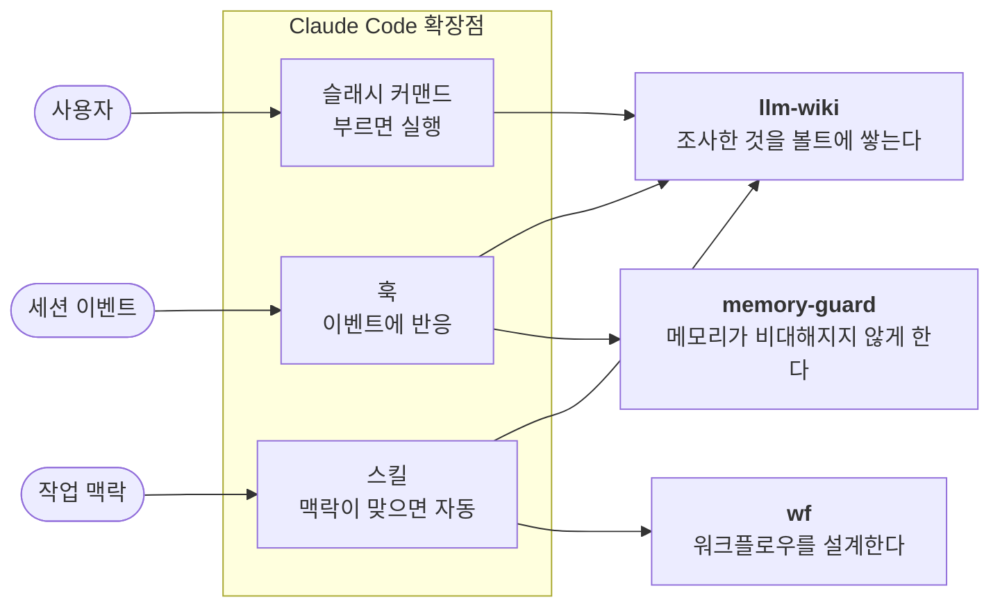

# cc-plugins

일하면서 반복해서 겪은 불편을 Claude Code 플러그인으로 만든 개인 마켓플레이스. 세 개가 있다.

셋은 각각 다른 불편에서 시작했지만, 만든 뒤에 한 일이 더 비슷하다. **한 번 만든 것을 계속 다시
판단한다** — 쓰지 않게 된 기능은 걷어내고, 폐기한 설계는 이유와 함께 남기고, 폐기 판단이 옳았는지는
나중에 숫자로 확인한다(검색 스택을 걷어낸 판단은 118문항 평가로 사후 검증했다). 지금 상태는
그 반복의 결과이고, **서드파티 패키지에 의존하는 곳이 한 곳도 없다.**

접은 설계는 지우지 않고 [`docs/plans/archived/`](./docs/plans/archived/)에 무엇을 왜 접었는지와
함께 남긴다.

## 플러그인

### [llm-wiki](./plugins/llm-wiki) · v0.28.0
**Obsidian 볼트를 지식 베이스로 운영한다.** 조사한 것을 다음에 다시 쓰고, 쌓인 것끼리 이어 붙인다.

기기를 옮겨 다니며 일하는데, 설치가 필요한 순간 그 기기에서는 위키가 열리지 않았다.
그래서 **설계를 마친 검색 백엔드를 구현 직전에 통째로 버렸다** — Bun CLI + Orama BM25 +
형태소 분석 + bge-m3 벡터 + rerank. 대신 CC 내장 Grep 전수검색으로 갔다. 볼트 8.5MB에서
`rg` 전수검색이 0.02초라 실측상 충분했기 때문이다.

포기한 것은 시맨틱 유사도와 rerank다. 무설치로는 불가하므로 수용했고, 대신 한국어 표기 변형은
쿼리 확장 규칙으로 메웠다. 이 판단은 나중에 118문항 평가셋으로 사후 검증했다 —
**MRR 0.955로, 버린 하이브리드 스택(0.868)보다 오히려 높았다**(MRR은 정답이 상위에 오는 정도로, 1에 가까울수록 좋다).
([평가 기록](./docs/research/2026-08-17-recall-grep-eval.md) · [버린 설계](./docs/plans/archived/2026-07-25-llm-wiki-search-design.md))

`node`만 있으면 된다 · 커맨드 4 · 스킬 2 · 훅 2 · 테스트 118

---

### [memory-guard](./plugins/memory-guard) · v0.3.0
**세션 메모리가 비대해지고 낡는 것을 막는다.** 인덱스를 키우는 write를 차단하고, 하루 한 번 점검한다.

메모리는 세션마다 통째로 로드된다. 많이 담으면 정작 시킬 작업의 예산을 잠식하고, 적게 담으면
맥락을 놓친다. 이 둘 사이를 매번 감으로 조절하고 있었고, 감을 한도로 바꾸고 싶었다.

한도는 상수로 박지 않고 **하드캡에서 유도한다** — 캡만이 사실이고 예산은 거기서 남긴 여유다.
항목 상한의 축을 문자가 아니라 바이트로 잡은 것도 같은 이유다. 한글은 UTF-8에서 3바이트라
"250자" 같은 상한은 크기 캡이 항상 먼저 걸려 **한 번도 구속하지 않는 죽은 규칙**이 된다.

두 hook의 성격을 의도적으로 갈랐다. 크기처럼 하드캡에 직결된 것만 차단하고, 깨진 링크·고아
토픽처럼 포맷을 추론해 판정하는 것은 알림에 그친다 — **오판한 알림은 무시하면 그만이지만,
오판한 차단은 데드락이다.**

`node`만 있으면 된다 · 훅 2 · 테스트 30

---

### [wf](./plugins/wf) · v0.4.0
**워크플로우를 설명하면 그에 맞는 워크플로우 플러그인을 설계한다.**

일의 내용은 프로젝트마다 다르지만 진행하는 방법은 대체로 같은데, 그 방법을 매번 처음부터 다시
설명하고 있었다. 바탕이 된 흐름은 매일 돌고 있는 것이다 — 기획 문서와 디자인 목업에서 근거를
모아 무엇을 고칠지, 사용자 플로우가 어떻게 되어야 하는지 정하고(**분석**), 손대기 전 화면을
브라우저 자동화로 촬영해 **as-is**를 남기고, 쓰는 스택의 공식 가이드와 커뮤니티 스킬을 로드해
TDD로 구현하고, 바뀐 결과를 다시 촬영해 **to-be**를 남기고, PR과 이슈 트래커에 그
증거를 붙여 **게시**한다. PR 이후 놓친 것이 나오면 증거 폴더에 라운드를 하나 더 만들고 같은
사이클을 다시 돈다.

이 플러그인은 그 흐름을 자동화한 것이 아니라, 거기서 **프로젝트에 종속된 부분(특정 문서 도구·
스택·게시처)을 걷어내고 남은 뼈대**다. 그래서 단계 이름조차 고정하지 않는다 — `wf:design`이
설명을 듣고 그 프로젝트의 단계를 도출한다.

검증은 보통 **만들어진 것**을 검사한다. 그런데 가장 비싼 실패는 **만들어지지 않은 것**이다 —
검토 축이 통째로 빠지면 검토된 축만 완벽하게 통과하고, 누락은 결과물이 나온 뒤에야 드러나
재작업이 된다. 그래서 정의 단계에 축(커버리지)을 두어 스크립트가 세게 하고, 정의를 정적
HTML로 렌더링해 빈 곳을 눈에 보이게 만든다.

축은 스킬이 아니라 스펙 파일의 데이터다. 그래서 **회고가 축을 늘리면 재생성 없이 다음 실행부터
반영된다** — 같은 누락을 두 번 겪지 않게 하는 것이 이 구조의 목적이다.

플러그인 구조 생성·검증은 `plugin-dev:create-plugin`이 이미 소유하므로 거기에 인계한다.

스킬 2 · 검사 스크립트 5 · 테스트 14

---

## 구조

세 플러그인이 Claude Code의 서로 다른 확장점에 붙는다.



커맨드는 사용자가 부를 때, 스킬은 작업 맥락이 맞을 때, 훅은 이벤트가 날 때 각각 진입한다.
llm-wiki가 셋을 다 쓰는 이유는 **캡처는 사용자가 부르지만 적재 규칙은 볼트에 쓸 때마다 적용되어야
하고, 정비와 커밋은 사람이 신경 쓰지 않아야 하기 때문**이다.

---

## 레포 상태

| | |
|---|---|
| 플러그인 | 3개 (llm-wiki v0.28.0 · memory-guard v0.3.0 · wf v0.4.0) |
| 유닛 테스트 | **162개** (`node --test` 148 · bash 14). 검색 품질 평가셋 118문항은 별개다 |
| 실행 환경 | `node`(CC 자체가 node로 돈다)와 `bash` 뿐 — **설치할 패키지가 없다** |
| 커밋 | 175개 · 2026-01 ~ 2026-09 |
| 이슈 관리 | [beads](https://github.com/steveyegge/beads) 43개 (완료 41). 데이터는 `refs/dolt/data` 에 격리 |

```bash
node --test plugins/llm-wiki/scripts/ plugins/llm-wiki/hooks/ plugins/memory-guard/src/
bash plugins/wf/scripts/check-coverage.test.sh
```

테스트는 판정 로직에 몰려 있다. 파일시스템과 네트워크를 만지는 부분은 어댑터 한 곳으로 밀어내고,
순수 함수만 스텁으로 테스트한다 — memory-guard의 한도 계산, llm-wiki의 lint 규칙과 챕터 분할이
그렇다.

---

## 설치

```bash
/plugin marketplace add aydenden/cc-plugins   # 등록 후 /plugin 에서 개별 선택
```

플러그인 하나만 바로 써보려면:

```bash
git clone https://github.com/aydenden/cc-plugins.git
claude --plugin-dir ./cc-plugins/plugins/llm-wiki
```

각 플러그인의 전제 조건은 서로 다르다. **llm-wiki는 Obsidian 볼트 경로(`WIKI_PATH`)가,
wf는 `bd`와 `plugin-dev`가 필요하다.** memory-guard는 아무 설정 없이 붙는다.
자세한 것은 각 플러그인 README에 있다.

## 라이선스

MIT
