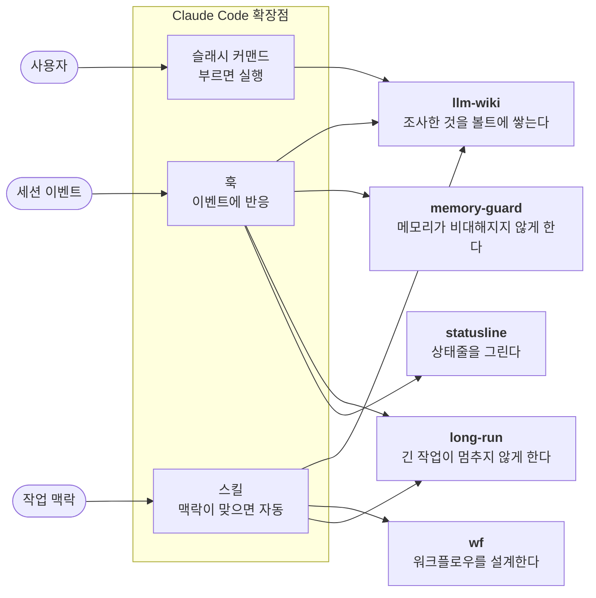

# cc-plugins

일하면서 반복해서 겪은 불편을 Claude Code 플러그인으로 만든 개인 마켓플레이스. 다섯 개가 있다.

각각 다른 불편에서 시작했지만, 만든 뒤에 한 일이 더 비슷하다. **한 번 만든 것을 계속 다시
판단한다** — 쓰지 않게 된 기능은 걷어내고, 폐기한 설계는 이유와 함께 남기고, 폐기 판단이 옳았는지는
나중에 숫자로 확인한다(검색 스택을 걷어낸 판단은 118문항 평가로 사후 검증했다). 지금 상태는
그 반복의 결과이고, **서드파티 패키지에 의존하는 곳이 한 곳도 없다.**

접은 설계는 지우지 않고 [`docs/plans/archived/`](./docs/plans/archived/)에 무엇을 왜 접었는지와
함께 남긴다.

## 플러그인

### [llm-wiki](./plugins/llm-wiki) · v0.31.0
**Obsidian 볼트를 지식 베이스로 운영한다.** 조사한 것을 다음에 다시 쓰고, 쌓인 것끼리 이어 붙인다.

기기를 옮겨 다니며 일하는데, 설치가 필요한 순간 그 기기에서는 위키가 열리지 않았다.
그래서 **설계를 마친 검색 백엔드를 구현 직전에 통째로 버렸다** — Bun CLI + Orama BM25 +
형태소 분석 + bge-m3 벡터 + rerank. 대신 CC 내장 Grep 전수검색으로 갔다. 볼트 8.5MB에서
`rg` 전수검색이 0.02초라 실측상 충분했기 때문이다.

포기한 것은 시맨틱 유사도와 rerank다. 무설치로는 불가하므로 수용했고, 대신 한국어 표기 변형은
쿼리 확장 규칙으로 메웠다. 이 판단은 나중에 118문항 평가셋으로 사후 검증했다 —
**MRR 0.955로, 버린 하이브리드 스택(0.868)보다 오히려 높았다**(MRR은 정답이 상위에 오는 정도로, 1에 가까울수록 좋다).
([평가 기록](./docs/research/2026-08-17-recall-grep-eval.md) · [버린 설계](./docs/plans/archived/2026-07-25-llm-wiki-search-design.md))

`node`만 있으면 된다 · 커맨드 4 · 스킬 2 · 훅 2 · 테스트 124

---

### [long-run](./plugins/long-run) · v0.2.0
**여러 세션에 걸치는 작업을 끝까지 민다.** 목표를 맵으로 세우고, 멈추려는 세션을 한 번 되민다.

며칠 걸리는 작업이 실패하는 자리는 대체로 어려움이 아니라 **멈춤**이었다. 한 덩이를 끝내고
«다음으로 갈까요?»로 돌아오거나, 컨텍스트가 차서 흐지부지되거나, 다음 세션이 어디까지 됐는지
모르는 채 다시 시작한다.

그래서 스킬 하나로 풀지 않았다. **스킬은 세션 안에서만 살아 경계를 못 넘기 때문**이다. 대신
세션 밖에 남는 셋으로 사슬을 굴린다 — 계약은 bd epic 본문(DB에 있어 세션이 죽어도 남는다),
강제는 Stop hook, 운반은 인계 문서다. 훅을 저장소가 아니라 **플러그인**에 단 것이 이 구조의
핵심이다. 긴 작업이 실제로 도는 곳은 worktree라 프로젝트 훅으로는 닿지 않는다.

되미는 강제에는 안전장치가 둘 있다. 맵을 선언하지 않은 세션은 건드리지 않고, `stop_hook_active`
면 무조건 통과시킨다 — **두 번째 막음은 세션을 영영 끝나지 않게 만든다.** 넘길 시점의 판정은
비율이 아니라 창 크기로 한다. 같은 토큰이 표준 창에서는 이미 초과이기 때문이다.

강제는 **mod**가 맡고 Stop hook은 대비로 남겼다. mod는 세션이 잰 실제 창 크기로 판정하고, 맵·남은
프론티어·컨텍스트를 상태줄에 늘 띄운다. 가드가 왜 안 막는지 `status`를 쳐 봐야 알던 자리다. mod가
안 뜨는 환경(구버전, 조직 정책)에서는 Stop hook이 예전처럼 혼자 판정한다 — **가드가 사라지는 경로는
만들지 않는다.**

`node` · 전제는 `bd`와 `orca` · 스킬 2 · mod 1 · 훅 1 · 테스트 54

---

### [memory-guard](./plugins/memory-guard) · v0.4.0
**세션 메모리가 비대해지고 낡는 것을 막는다.** 인덱스를 키우는 write를 차단하고, 하루 한 번 점검한다.

메모리는 세션마다 통째로 로드된다. 많이 담으면 정작 시킬 작업의 예산을 잠식하고, 적게 담으면
맥락을 놓친다. 이 둘 사이를 매번 감으로 조절하고 있었고, 감을 한도로 바꾸고 싶었다.

한도는 상수로 박지 않고 **하드캡에서 유도한다** — 캡만이 사실이고 예산은 거기서 남긴 여유다.
항목 상한의 축을 문자가 아니라 바이트로 잡은 것도 같은 이유다. 한글은 UTF-8에서 3바이트라
"250자" 같은 상한은 크기 캡이 항상 먼저 걸려 **한 번도 구속하지 않는 죽은 규칙**이 된다.

두 hook의 성격을 의도적으로 갈랐다. 크기처럼 하드캡에 직결된 것만 차단하고, 깨진 링크·고아
토픽처럼 포맷을 추론해 판정하는 것은 알림에 그친다 — **오판한 알림은 무시하면 그만이지만,
오판한 차단은 데드락이다.**

토픽 파일도 같은 논리로 본다. CC 리콜은 파일마다 description만 보고 고르고 앞 4KB만 보여주므로,
커진 토픽을 `.1`·`.2`로 이어 쪼개면 뒷조각은 거의 안 찾힌다 — 그래서 안내는 **분할보다 병합**이다.

`node`만 있으면 된다 · 훅 2 · 테스트 36

---

### [statusline](./plugins/statusline) · v0.1.0
**mod로 그리는 상태줄.** 외부 도구 없이 프롬프트 아래에 모델·git·컨텍스트·사용량을 띄운다.

쓰던 상태줄은 `npx`로 도는 외부 도구였다. `statusLine` 설정은 다시 그릴 때마다 명령을 통째로
실행하므로, 도구가 아무리 잘 만들어져 있어도 **그릴 때마다 프로세스 하나를 띄우는 값**은 남는다.
사용량을 보여 주려고 엔진이 이미 아는 숫자를 API로 다시 묻는 것도 같은 구조에서 나온다.

mod는 그 값을 엔진에서 이벤트로 받는다. 컨텍스트와 5시간·주간 사용량은 네트워크 호출 없이 오고,
프로세스는 git처럼 엔진 밖의 값이 필요할 때만 뜬다. **켜진 위젯이 요구하는 것만 모은다** — git
위젯을 다 끄면 git도 부르지 않는다.

그릴 자리는 문서가 아니라 실측으로 정했다. 상태줄용으로 보이는 `$.ui.status`는 돌려 보면 색도
줄바꿈도 못 쓰는 알림 한 줄이었고, 여러 줄·배경색·오른쪽 정렬이 되는 곳은 프롬프트 아래 힌트
줄이었다. 대응 값이 없어 보이던 위젯(모델별 주간 사용량, 세션 이름, 노력 수준)도 프로브 mod로
하나씩 찍어 보고 나서야 가능한 쪽으로 넘어왔다. 끝까지 남은 것은 Vim의 실시간 모드 하나다.

배치는 줄 → 항목이고 둘 다 `enabled`로 끈다. 꺼도 순서와 옵션이 남아야 다시 켤 수 있기 때문이다.
위젯 id는 쓰던 도구의 것을 그대로 받아 그 설정을 한 번에 옮겨 온다.

`node` · mod 1 · 위젯 86 · 테스트 66

---

### [wf](./plugins/wf) · v0.5.0
**워크플로우를 설명하면 그에 맞는 워크플로우 플러그인을 설계한다.**

일의 내용은 프로젝트마다 다르지만 진행하는 방법은 대체로 같은데, 그 방법을 매번 처음부터 다시
설명하고 있었다. 바탕이 된 흐름은 매일 돌고 있는 것이다 — 기획 문서와 디자인 목업에서 근거를
모아 무엇을 고칠지, 사용자 플로우가 어떻게 되어야 하는지 정하고(**분석**), 손대기 전 화면을
브라우저 자동화로 촬영해 **as-is**를 남기고, 쓰는 스택의 공식 가이드와 커뮤니티 스킬을 로드해
TDD로 구현하고, 바뀐 결과를 다시 촬영해 **to-be**를 남기고, PR과 이슈 트래커에 그
증거를 붙여 **게시**한다. PR 이후 놓친 것이 나오면 증거 폴더에 라운드를 하나 더 만들고 같은
사이클을 다시 돈다.

이 플러그인은 그 흐름을 자동화한 것이 아니라, 거기서 **프로젝트에 종속된 부분(특정 문서 도구·
스택·게시처)을 걷어내고 남은 뼈대**다. 그래서 단계 이름조차 고정하지 않는다 — `wf:design`이
설명을 듣고 그 프로젝트의 단계를 도출한다.

검증은 보통 **만들어진 것**을 검사한다. 그런데 가장 비싼 실패는 **만들어지지 않은 것**이다 —
검토 축이 통째로 빠지면 검토된 축만 완벽하게 통과하고, 누락은 결과물이 나온 뒤에야 드러나
재작업이 된다. 그래서 정의 단계에 축(커버리지)을 두어 스크립트가 세게 하고, 정의를 정적
HTML로 렌더링해 빈 곳을 눈에 보이게 만든다.

축은 스킬이 아니라 스펙 파일의 데이터다. 그래서 **회고가 축을 늘리면 재생성 없이 다음 실행부터
반영된다** — 같은 누락을 두 번 겪지 않게 하는 것이 이 구조의 목적이다.

플러그인 구조 생성·검증은 `plugin-dev:create-plugin`이 이미 소유하므로 거기에 인계한다.

스킬 2 · 검사 스크립트 5 · 테스트 14

---

## 구조

다섯 플러그인이 Claude Code의 서로 다른 확장점에 붙는다.


```mermaid
flowchart LR
  U(["사용자"]) --> CMD
  E(["세션 이벤트"]) --> HK
  X(["작업 맥락"]) --> SKL

  subgraph EXT["Claude Code 확장점"]
    CMD["슬래시 커맨드<br/>부르면 실행"]
    SKL["스킬<br/>맥락이 맞으면 자동"]
    HK["훅<br/>이벤트에 반응"]
  end

  CMD --> LW
  SKL --> LW
  SKL --> WF
  SKL --> LR
  HK  --> LW
  HK  --> MG
  HK  --> LR
  HK  --> ST

  LW["<b>llm-wiki</b><br/>조사한 것을 볼트에 쌓는다"]
  LR["<b>long-run</b><br/>긴 작업이 멈추지 않게 한다"]
  MG["<b>memory-guard</b><br/>메모리가 비대해지지 않게 한다"]
  ST["<b>statusline</b><br/>상태줄을 그린다"]
  WF["<b>wf</b><br/>워크플로우를 설계한다"]
```

커맨드는 사용자가 부를 때, 스킬은 작업 맥락이 맞을 때, 훅은 이벤트가 날 때 각각 진입한다.
llm-wiki가 셋을 다 쓰는 이유는 **캡처는 사용자가 부르지만 적재 규칙은 볼트에 쓸 때마다 적용되어야
하고, 정비와 커밋은 사람이 신경 쓰지 않아야 하기 때문**이다.

---

## 테스트

실행 환경은 `node`(CC 자체가 node로 돈다)와 `bash`뿐이다 — **설치할 패키지가 없다.**
예외는 llm-wiki의 `surya-guard` 테스트 하나로, `python3`가 있어야 한다(가드가 marker의 파이썬
안에서만 도는 파일이라서다).

```bash
node --test "plugins/**/*.test.mjs"
for f in $(find plugins -name '*.test.sh'); do bash "$f"; done
```

테스트는 판정 로직에 몰려 있다. 파일시스템과 네트워크를 만지는 부분은 어댑터 한 곳으로 밀어내고,
순수 함수만 스텁으로 테스트한다 — memory-guard의 한도 계산, llm-wiki의 lint 규칙과 챕터 분할이
그렇다.

---

## 설치

```bash
/plugin marketplace add aydenden/cc-plugins   # 등록 후 /plugin 에서 개별 선택
```

플러그인 하나만 바로 써보려면:

```bash
git clone https://github.com/aydenden/cc-plugins.git
claude --plugin-dir ./cc-plugins/plugins/llm-wiki
```

각 플러그인의 전제 조건은 서로 다르다. **llm-wiki는 Obsidian 볼트 경로(`WIKI_PATH`)가,
wf는 `bd`와 `plugin-dev`가, long-run은 `bd`와 `orca`가 필요하다.** memory-guard는 아무 설정
없이 붙고, statusline은 mod가 뜨는 Claude Code(v2.1.287 이상)면 된다.
자세한 것은 각 플러그인 README에 있다.

## 라이선스

MIT
